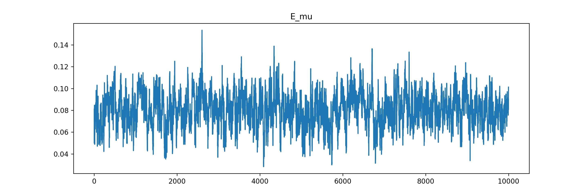
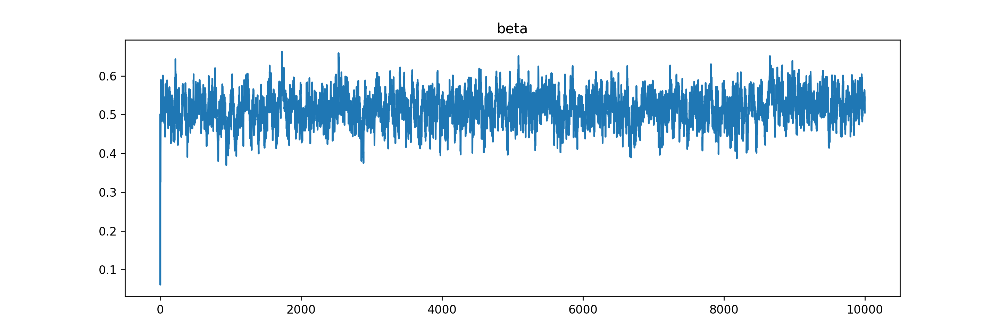
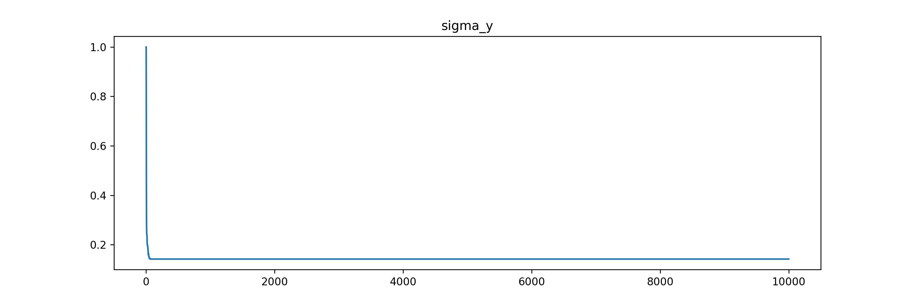
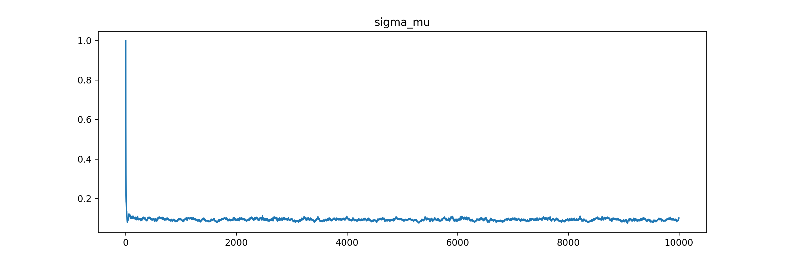
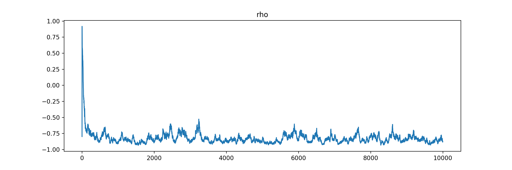

# ReturnDynamicsMCMC
### : Implementing MCMC algorithms to find parameters in Return Dynamics

## [ How to run ]
- **"setup.txt"** in the main directory is the setting file for how to implement MCMC 
- It contains the options that choose either performing simulation or using observed data,
  MCMC initial guess for paramters and hyperparameters
- Using the shell script below, you may implement MCMC and have figures that summarize final results

```
:~$ ./run.sh
```

## [ Results of iterations for the parameters from a MCMC implementation ]












## [ Prerequisites for this code in Ubuntu ]
### Core library needed for C++
- **Eigen3**
```
:~$ sudo apt-get install -y apt-get install libeigen3-dev
```
### Graphic tool in Python script
- **Python3**
```
sudo apt-get install -y python3 python3-pip python3-dev python3-env
```
- **Numpy & Scipy**
```
sudo pip install numpy scipy
```
- **Matplotlib**
```
sudo pip install matplotlib
```
